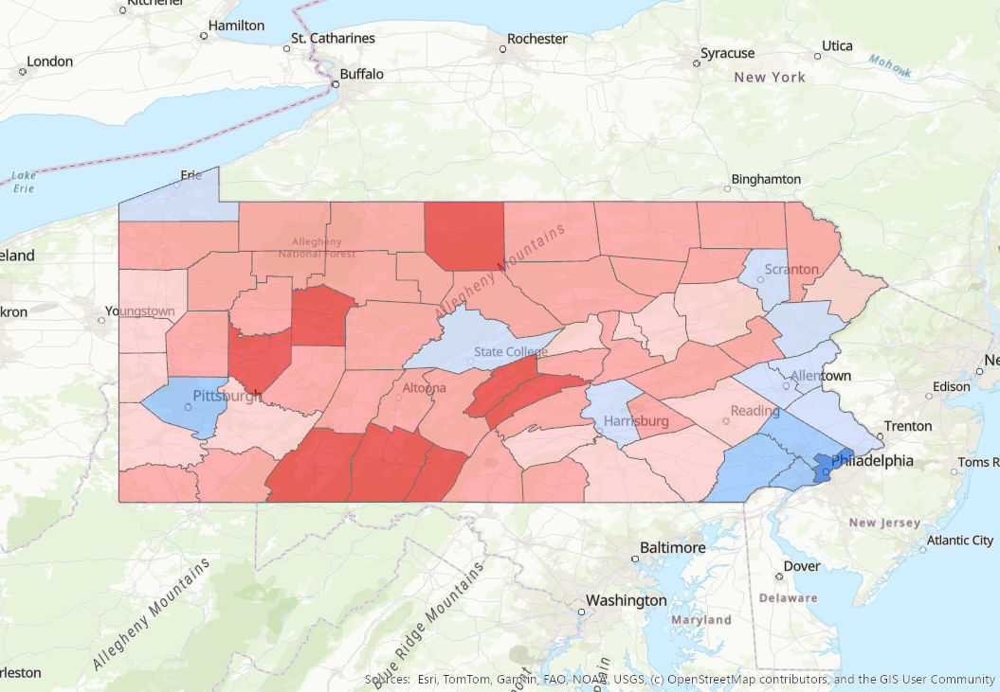

  

 
### Spatial Problem
Visualizing 2020 county-level election results while maintaining a clean visual hierarchy that accurately represents various margin criteria.
 
 
### GIS Methodology
This map was part of Mastery Assignment #2, where we were asked to create an election map for Pennsylvania based off of 2020 results. In particular, we were required to get creative and "code" in the different margin criteria to create a visually appealing choropleth display. The central challenge in creating this map was that the data was not readily available; instead, it had to be manually organized by drawing upon skills such as joining tables, adding data fields with the correct data type, and conducting in-depth "Select by Attribute" searches. We were also required to use a red/blue gradient scale in the map display, necessitating attention to detail when choosing colors that would properly convey the strength of political affiliation per county. Overall, creating this map was an exercise in translating messy, real-life data into usable and visually appealing categories.
* **Skills Used:** Proper CRS conversion, table joins/relates, adding fields, attribute selection, field calculation, visual hierarchy in symbology

[Download my Draw.io Plan (JPEG)](FGISMastery2ElectionMapPlan.jpg)
