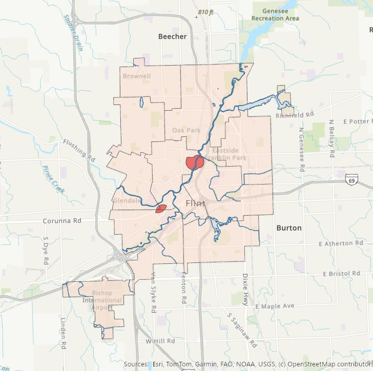

  

 
### Spatial Problem
Determining the geographic location of communities that are most vulnerable to drinking poisonous tap water in Flint, Michigan.
 
 
### GIS Methodology
This map was part of Mastery Assignment #3, where we were asked to determine the locations of the most at-risk communities for drinking contaminated tap water in Flint, Michigan. These communities needed to be within specific proximities to toxic release facilities, rivers, and lead pipelines. Creating a map that captured all of the required criteria necessitated not only drawing upon a variety of tools, but also using them in the correct sequence. These tools include buffer functions to measure distance, clipping functions to "clean up" the data layers, and intersect operations to determine which areas fit all requirements. By layering this operations, I was able to create an "at-risk" layer (highlighted in red) that revealed concentrated zones of vulnerability. This map provides a visual narrative that translates environmental data into actionable geographic insights.

* **Skills Used:** Buffer functions, clip functions, intersect functions, joins and relates 

[Download my Full Map](FPFLINT.jpg)
 
[Download my Draw.io Plan](FGISMastery3plan.jpg)
