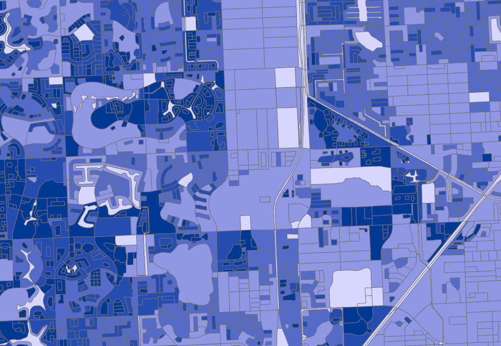

  

    <a href="projects.md">Projects</a> | 
    <a href="about.md">About</a> | 
    <a href="contact.md">Contact</a>
  

# Welcome!

Hi! I’m Mia Hopkins, a Sustainability Master's student at Temple University. These are some of my favorite maps I've created for my Fundamentals of Geographic Information Systems class. Feel free to explore!

