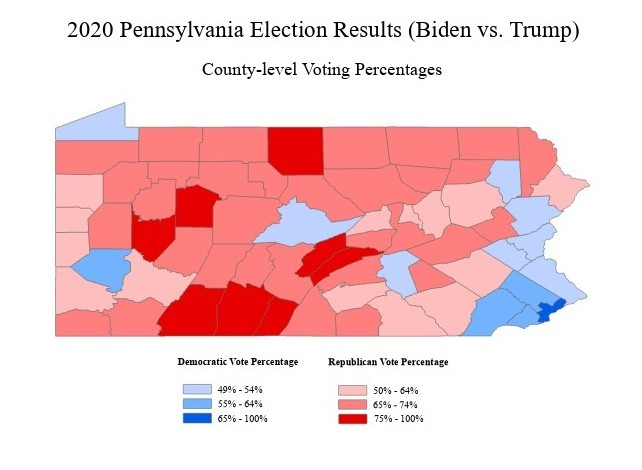

Here are some of my favorite maps that I've created throughout this course:

  

    
    
<strong>2020 Election Map</strong> <em>Creating visually appealing choropleth maps</em>

  

  

    
    
<strong>Water Toxicity in Flint, MI</strong> <em>Mapping toxic proximity with buffer tools</em>

  

  

    
    
<strong>Population Density in Miami-Dade</strong> <em>Visualizing density at multiple scales</em>

  

