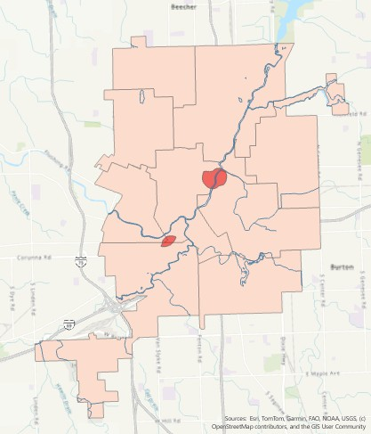

# Projects

Here are some of my favorite maps that I've created throughout this course:

| [2020 Election Map](./electionmap) | [Water Toxicity in Flint, MI](./flint) | [Population Density in Miami-Dade County](./miamidade) |
| :---: | :---: | :---: |
|  |  |  |
| *Creating visually appealing choropleth maps* | *Mapping toxic proximity with buffer and overlay tools* | *Visualizing population density at multiple scales* |
